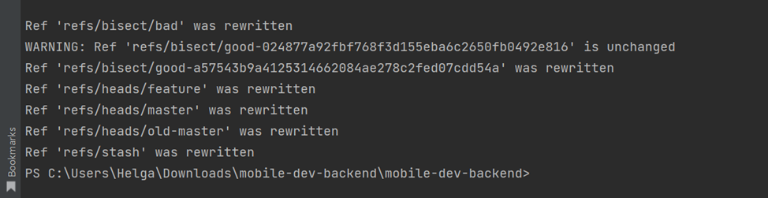
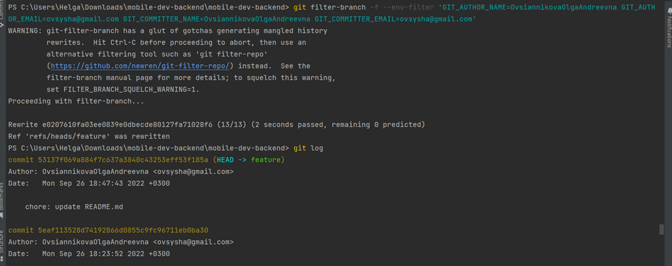

1. git instaweb --start

    git instaweb --start --port 5432 

    git instaweb --browser chrome

2.  git checkout ci   

    git rebase -i HEAD~11

    git rebase master   

    git checkout master

    git merge ci

    git branch -d ci
        
    
    
    
3. git log --reflog

   git checkout 1003a0301ea01afe83c562665e829f8c7461c488 

   git branch old-master
   
   
   
4. git log -L 32:prisma/seed.ts
   
5. npm run test  

   git bisect start

   git bisect bad

   git bisect start

   git bisect good 024877a9

   git bisect bad     

   npm run test  

   git bisect good

   npm run test   

   git bisect bad
   
   
6. git filter-branch --force --index-filter 'git rm --cached --ignore-unmatch .env' --prune-empty --tag-name-filter cat -- --all
   
   
7. git checkout feature

   git filter-branch -f --env-filter 'GIT_AUTHOR_NAME=OvsiannikovaOlgaAndreevna GIT_AUTHOR_EMAIL=ovsysha@gmail.com GIT_COMMITTER_NAME=OvsiannikovaOlgaAndreevna GIT_COMMITTER_EMAIL=ovsysha@gmail.com'
   
